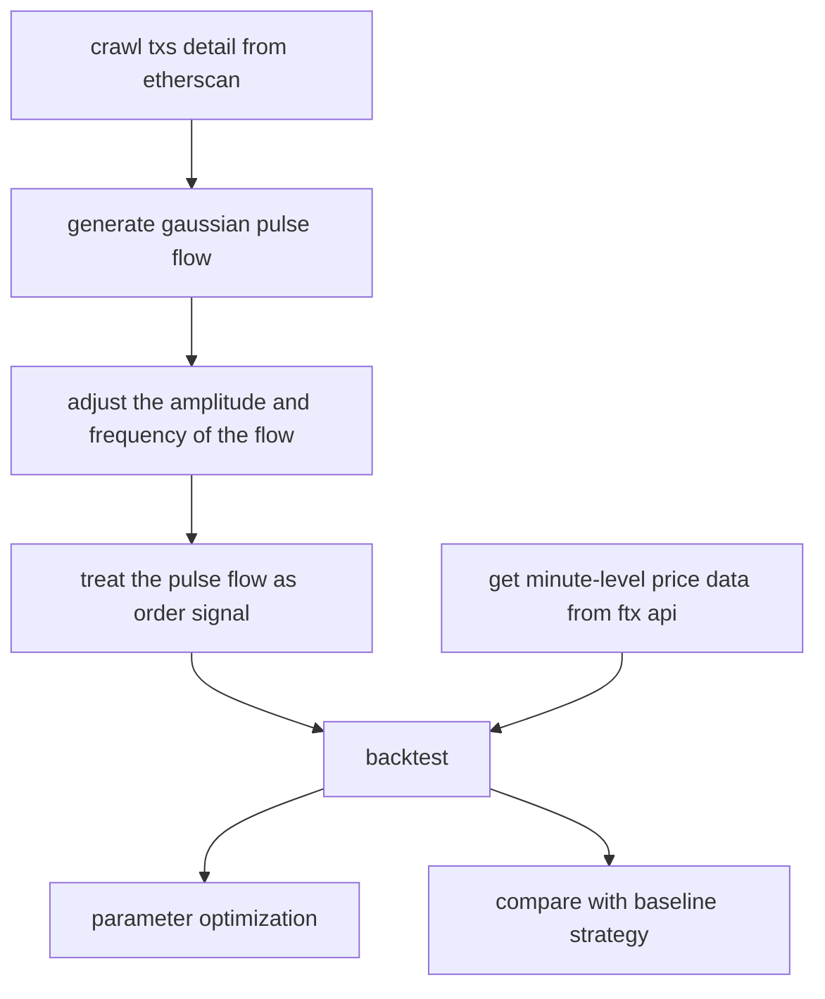

# Transaction Flow Pulse Strategy

I implemented a  timing strategy based on the transaction data on the block

Due to limited time and resources, in this case we only use **ETH/USD** as the target, the time range is from **May 27 to June 8, 2022**, and the block is **Binance 14**. If more targets, longer time periods, and more block data are used, I believe the effect of the strategy will be more robust.

## Strategy

After analyzing the out txs data on the https://etherscan.io/, we consider the large value out txs as pulse when it is higher than the threshold. Then the pulse of each point is integrated into a pulse stream, and the frequency is adjusted as a timing signal. We short ETH/USD and close the position after a window(for exmple, 5 minutes). In our backtest, we didn’t take fees into consideration.

My baseline strategy is MA 5-minutes broke above the MA 30-minutes.

## Technology Roadmap

The detail of every step will be explained in the next part.

## Details

### crawl txs detail from etherscan

exchangeFlow.py provides class flowTracker to download txs data of specified exchanges and date

**get_exchange_address()**

get the address of every exchange we provided.

**check_active_exchange()**

check whether the address we crawled in the last step has been active from startDate.

**save_valid_address()**

save the active address.

**get_curr_trans()**

get the txs records of the first page of an address

**get_freq_trans()**

get all of txs records we need and save it in a csv file.

###  generate gaussian pulse flow

**gaussPulse()**

The function of Gaussian pulse is given by:
$$
x(t) = ae^{-t^2 \over 2 \sigma ^ 2}
$$
where a is the amplitude, t is the time, $\sigma$ is the std.

**genPulseflow()**

generate the pulse stream.

When a pulse is generated, in the next 100 dt, it will decay and continue. If we superimpose these pulses on the timeline, we get the stream.

PS: I use a series as a queue to store the pulse effect of every moment.

**signalAdjust()**

draw the pulse stream, clear the pulse under the threshold and combine the pulse with the target price in one plot. 

### get minute-level price data from ftx api

**get_historical_data()**

use **ftx** api to get historical price data.

### backtest

**tiemlineMerge()**

Because the price data I used is minute-level, so I take the next closest time in price data, after each pulse signal occurs, as the actual signal.

I use the sort_index and fillna of pandas to realize the function.

**pointAna()**

show the average performance of the target after signals.

**backTest()**

use multi-channel backtesting to test the performance of the signal.

return the account detail and position detail of every moment.

**analyse()**

analyze the performance of the backtesting (mean daily return, mean daily volatility, Sharpe, max drawdown etc.) and plot

## performance

There are several parameter to optimize, we take pulse threshold in **signalAdjust()** as an example.

Performance with different pulse threshold is given by:

|                        | 2               | 2.25            | 2.5             | 2.75            | 3               |
| ---------------------- | --------------- | --------------- | --------------- | --------------- | --------------- |
| mean daily  return     | 0.00387         | 0.00397         | 0.00410         | 0.00388         | 0.00400         |
| mean daily  volatility | 0.00707         | 0.00707         | 0.00698         | 0.00691         | 0.00690         |
| Sharpe                 | 0.54704         | 0.56212         | 0.58680         | 0.56107         | 0.58001         |
| max drawdown           | 0.01888         | 0.01888         | 0.01666         | 0.01681         | 0.01681         |
| drawdown time          | 2022/5/31 16:48 | 2022/5/31 17:09 | 2022/5/31 16:43 | 2022/5/31 17:10 | 2022/5/31 17:10 |

When threshold is 2.5:

The left plot is the initial pulse timeline, the right one is adjusted pulse with target price trend.

The above plot is the relative net value trend of my strategy.

## future development

First of all,  if more targets, longer time periods, and more block data are used, I believe the effect of the strategy will be more robust.

Second, the position close time can also use signal, which I haven’t try.

Third, more parameter should be searched.

